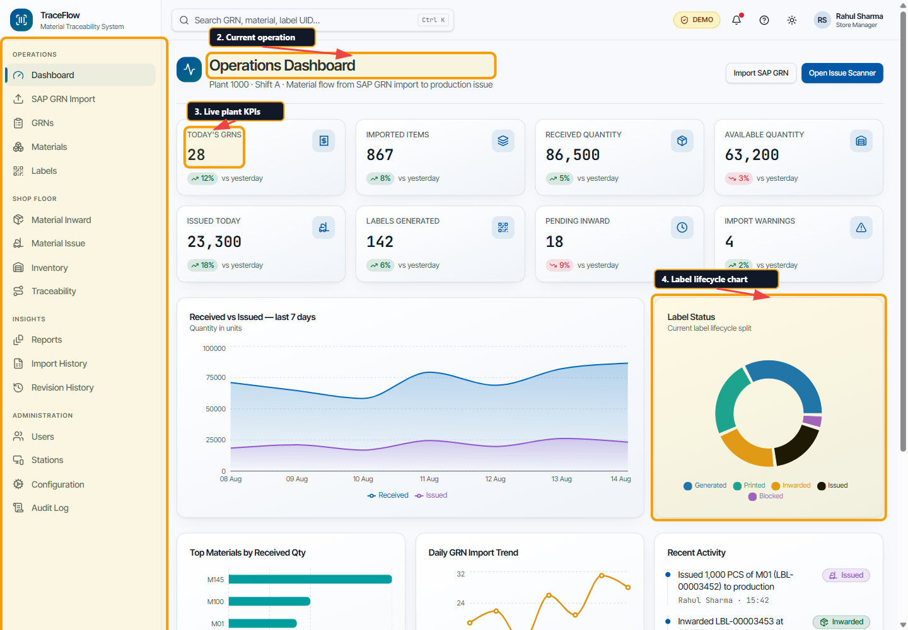
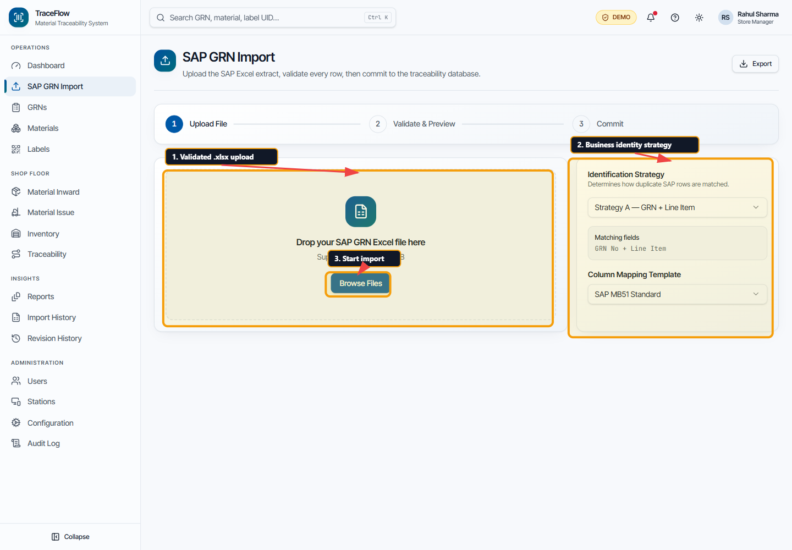
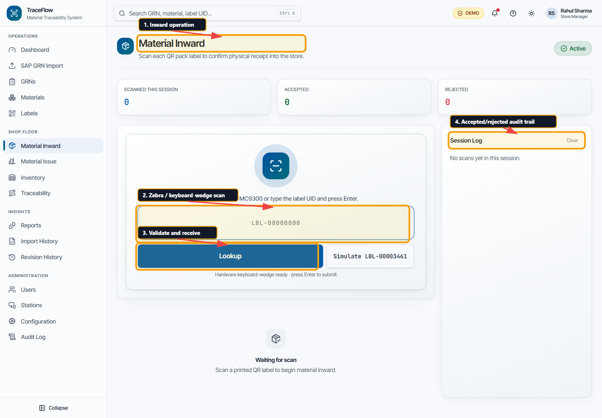
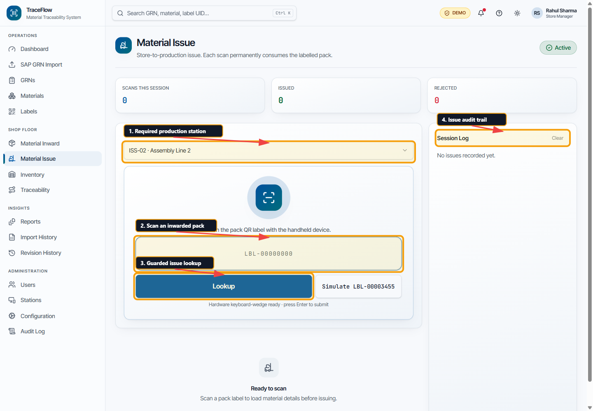
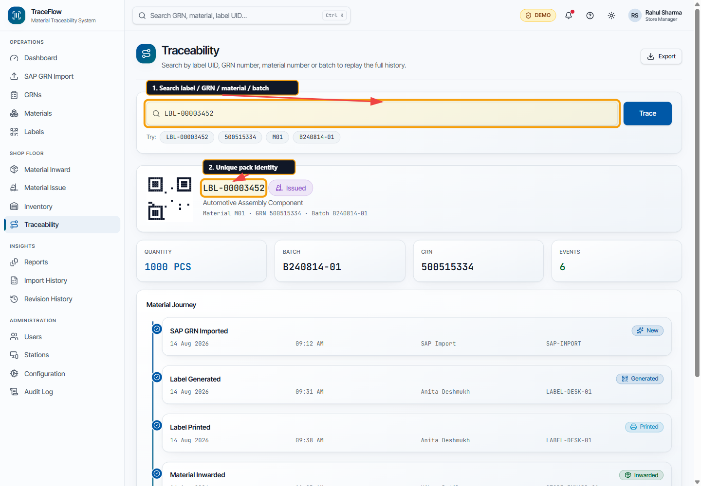
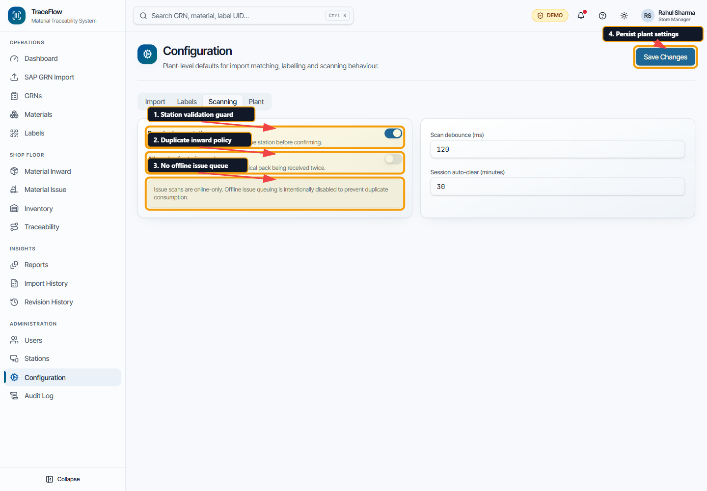
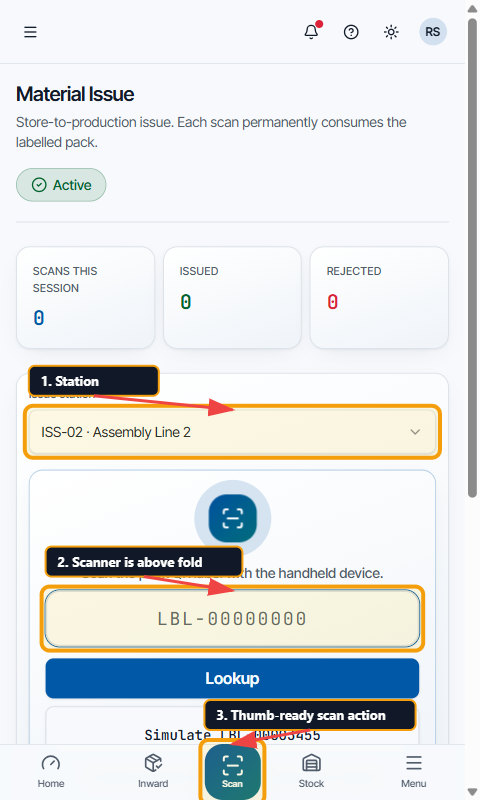

# TrackGRN Playwright Functional Test Report

**Test date:** 15 August 2026  
**Application:** TraceFlow / TrackGRN  
**UI:** React 19, TanStack Router, TypeScript  
**API foundation:** ASP.NET Core 8 with SQL Server 2022 Express  
**Automation:** Playwright Chromium and Axe WCAG checks

## Outcome

The UI route matrix, critical business workflows, handheld layouts, runtime health and accessibility checks are automated. Bugs found during the run were corrected in the existing TraceFlow visual pattern and then regression-tested.

The final clean run discovered 138 project/test combinations: **51 passed, 0 failed, and 87 were intentionally skipped by project routing**. Desktop-only functional checks run once; handheld projects run only their responsive matrix, so those skips are expected rather than untested failures.

## Environments covered

| Profile | Viewport / device behavior | Purpose |
|---|---:|---|
| Desktop Chromium | 1440 × 1000 | Complete route and functional suite |
| Pixel 7 | Playwright device profile | Touch/mobile overflow and navigation |
| Zebra MC9300 profile | 480 × 800, touch enabled | Plant handheld scanner reachability |

All tests use reduced motion, one worker and deterministic mock service data. Failed tests retain screenshots, video and Playwright traces in `UItrackGRN/test-results`.

## Automated coverage

| Area | Automated assertions |
|---|---|
| Route health | 17 application routes render their expected heading, produce no runtime/console error and have no body-level horizontal overflow |
| Authentication | Invalid credentials remain on login with an error; valid demo credentials open the dashboard; pre-hydration native form submission is blocked |
| SAP import | `.csv` rejection, `.xlsx` acceptance, 10 MB rule, preview, confirmation and commit feedback |
| GRNs | Search and navigation to a multi-material GRN; all four expected material lines |
| Labels | Reprint confirmation, success feedback, table search, optional columns, pagination and CSV export |
| Inward / issue | Generated pack cannot issue; single inward; duplicate inward rejection; confirmed issue; duplicate issue rejection |
| Traceability | Label search, complete lifecycle display, not-found state and global Ctrl+K hand-off |
| Shell controls | Notifications, user menu navigation, sidebar collapse/expand, theme persistence and 404 recovery |
| Reports / configuration | Report generation feedback, scanning policy state and configuration save feedback |
| Connectivity / PWA | Offline warning on issue route, production service-worker registration and browser-controlled install prompt |
| Responsive | Dashboard, inward, issue, inventory and traceability on Pixel/Zebra with no horizontal overflow |
| Zebra reachability | Issue scanner input remains inside the initial 800 px viewport |
| Accessibility | Serious/critical WCAG A/AA scan on dashboard, login, import, inward, issue, traceability and configuration |

## Defects found and fixed

| ID | Defect | Resolution / regression guard |
|---|---|---|
| TF-01 | A click before React hydration could trigger native `?` form navigation | Added a hydration-ready marker and disabled login submit until hydration; Playwright waits for the same explicit readiness signal |
| TF-02 | Any username/password was accepted | Added exact demo credential validation and invalid-login coverage |
| TF-03 | Import accepted `.csv`/`.xls` and ignored maximum size | Restricted input/drop validation to `.xlsx` and 10 MB |
| TF-04 | Mock generation produced duplicate `LBL-00003452` IDs | Corrected the UID sequence; traceability now targets a unique pack |
| TF-05 | Generated/printed labels could be issued without inward | Added purpose-aware scanner guards (`inward` and `issue`) |
| TF-06 | The same label could be inwarded or issued repeatedly | Added duplicate inward/issue and blocked/cancelled state checks |
| TF-07 | Scan status vanished after route reload in the mock UI | Persisted mock label status in browser storage; the API remains the production source of truth |
| TF-08 | Confirmation dialog cleared the pending issue before its async mutation completed | The issue mutation now owns an immutable label snapshot |
| TF-09 | Inward UI introduced rack/bin management, which is outside the master scope | Removed destination-bin controls and messages; `binSequence` remains pack sequence on labels |
| TF-10 | UI suggested fake sample IDs | Replaced examples with records that exist in the test dataset |
| TF-11 | Offline issue queue could be enabled | Replaced it with an explicit online-only issue rule and offline warning |
| TF-12 | Install banner was simulated rather than connected to the browser event | Install control now appears only for a real `beforeinstallprompt`; production registers a service worker |
| TF-13 | Global search and Ctrl+K hint were inert | Implemented keyboard focus, query navigation and automatic trace search |
| TF-14 | Scanner card was too tall on a 480 × 800 handheld | Compacted mobile stats/scanner spacing while retaining desktop sizing |
| TF-15 | Contrast, select names, switches and pie-chart sectors failed accessibility checks | Darkened the same brand tokens, added accessible labels, and named each SVG sector |
| TF-16 | Recharts animation could leave screenshots with incomplete/blank charts | Disabled non-essential chart animation for deterministic output |

## Annotated evidence

### Dashboard and operational KPIs



### SAP GRN import and business identity selection



### Material inward scanner



### Material issue scanner



### End-to-end traceability



### Scanning safeguards



### Zebra-sized issue workflow



## How to run

From `D:\TrackGRN`:

```powershell
# One-time browser/dependency setup
npm.cmd run ui:install
cd UItrackGRN
npm.cmd exec playwright install chromium
cd ..

# Complete UI suite: desktop + Pixel + Zebra
npm.cmd run ui:e2e

# Faster focused runs
npm.cmd run ui:e2e:desktop
npm.cmd run ui:e2e:mobile

# Build UI and API, then run API + UI tests
npm.cmd run build
npm.cmd test
```

Open the HTML report after a run:

```powershell
cd UItrackGRN
npm.cmd run test:e2e:report
```

## Verification record

| Check | Result |
|---|---|
| UI production build | Pass |
| Desktop functional/route suite | Pass after fixes |
| Pixel 7 responsive matrix | Pass |
| Zebra 480 × 800 responsive matrix | Pass |
| WCAG serious/critical checks | 7/7 screens pass |
| API unit/integration tests | 8/8 pass from the API foundation verification |
| SQL migration + seed + API smoke | Pass from the API foundation verification |
| Full final Playwright suite | Pass — 51 passed, 0 failed, 87 expected project skips (138 discovered) |

## Boundary of this test report

The current UI service layer still uses deterministic browser mock data. These tests prove UI behavior and client-side business guards; they do not claim that every UI screen is already wired to the ASP.NET API. Physical Zebra trigger hardware, thermal printer output, real SAP Excel variations, plant LAN interruption and SQL concurrency require hardware/contract/integration testing once the API endpoints replace the mock service bodies.
